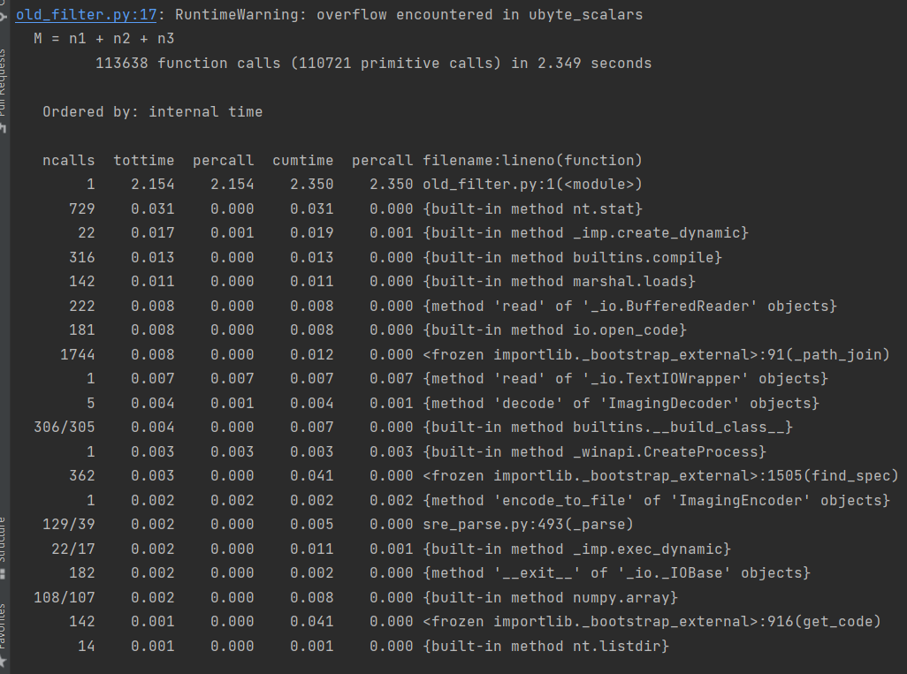

## Сравнение результатов тестирования

На первом изображении представлены результаты профилирования отрефакторенного кода

На втором изображении представлены результаты профилирования неотрефакторенного кода

Как можно заметить, в старом файле код даже не выполнился из-за переполнения, а в новом выполнился, но более 9 секунд ушло на ввод данных
