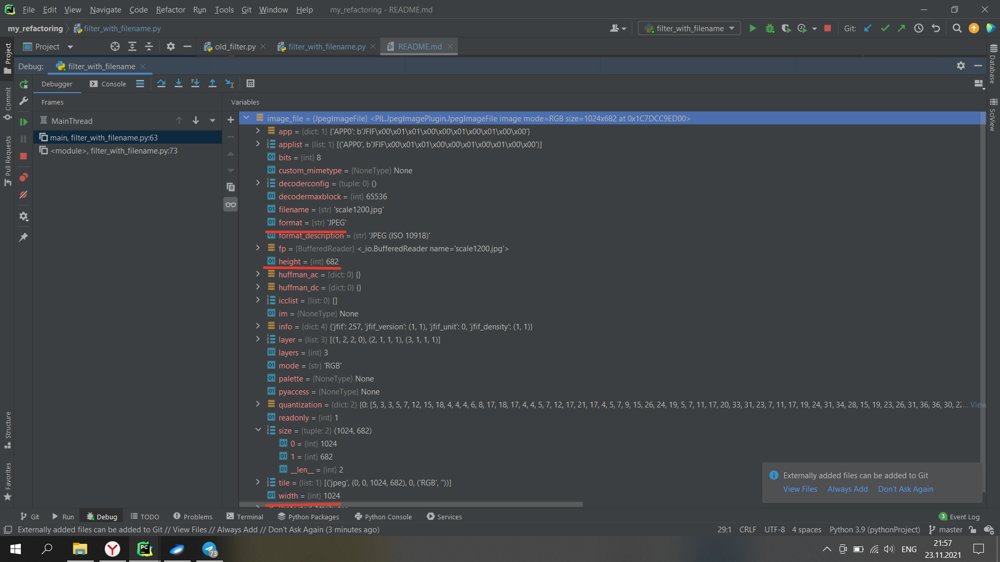
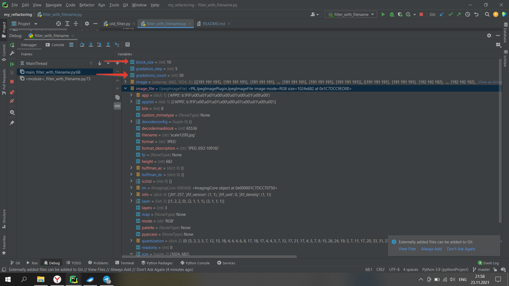

## Сравнение результатов тестирования

На первом изображении представлены результаты профилирования отрефакторенного кода

На втором изображении представлены результаты профилирования неотрефакторенного кода

Как можно заметить, в старом файле код даже не выполнился из-за переполнения, а в новом выполнился, но более 9 секунд ушло на ввод данных

На этом изображении результаты тестирования файла без ввода. Работа программы заняла всего 0.2 секунды.

## Результаты преобразования картинки

Картинка до преобразования:

Картинка с неправильным преобразованием:

Картинка с правильным преобразованием:

## Тесты

Все тесты проходятся

## Отладчик

Высота и ширина картинки:

Ширина блока и количество градаций серого:

